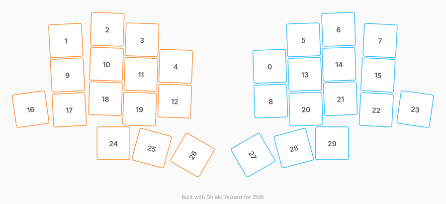

# ZMK Configuration for eden

*Generated by Shield Wizard for ZMK*



Download compiled firmware from the Actions tab. <https://zmk.dev/docs/user-setup#installing-the-firmware>

Edit your keymap <https://zmk.dev/docs/keymaps>.
User keymap is located at [`config/eden.keymap`](config/eden.keymap).

-----

<details>
<summary>
Shield Wizard Debug Information
</summary>

In case of broken configuration, here is the Shield Wizard internal data used to generate this configuration:

Commit: 84a348b08cf4fec4a5441a46147e9a345b10ffab

```json
{"name":"eden","shield":"eden","dongle":false,"modules":[],"layout":[{"id":"01M29S26HTC6CGDRQ4GMYXXR9F","part":1,"row":0,"col":0,"w":1,"h":1,"x":6.35,"y":0.56,"r":-2,"rx":6.85,"ry":1.06},{"id":"01M29S26HSCXKXZBJ4JZK4Q230","part":0,"row":0,"col":1,"w":1,"h":1,"x":0.49,"y":-0.18,"r":-3,"rx":0.99,"ry":0.32},{"id":"01M29S26HSCS2P7MRS2A98B14X","part":0,"row":0,"col":2,"w":1,"h":1,"x":1.7,"y":-0.5,"r":2,"rx":2.2,"ry":0},{"id":"01M29S26HSBJB4FBTB69A7SWSR","part":0,"row":0,"col":3,"w":1,"h":1,"x":2.68,"y":-0.2,"r":2,"rx":3.18,"ry":0.3},{"id":"01M29S26HTK68YPWXWQZVFEZP3","part":0,"row":0,"col":4,"w":1,"h":1,"x":3.65,"y":0.56,"r":2,"rx":4.15,"ry":1.06},{"id":"01M29S26HT21DNRDZC3TCPNEQS","part":1,"row":0,"col":6,"w":1,"h":1,"x":7.32,"y":-0.2,"r":-2,"rx":7.82,"ry":0.3},{"id":"01M29S26HT6SBZBNMQC97CNFF0","part":1,"row":0,"col":7,"w":1,"h":1,"x":8.31,"y":-0.5,"r":-2,"rx":8.81,"ry":0},{"id":"01M29S26HTN9WJY01BGKPZGE8T","part":1,"row":0,"col":8,"w":1,"h":1,"x":9.52,"y":-0.18,"r":3,"rx":10.02,"ry":0.32},{"id":"01M29S26HTJ8K803NCX6K0YHR2","part":1,"row":1,"col":0,"w":1,"h":1,"x":6.38,"y":1.56,"r":-2,"rx":6.88,"ry":2.06},{"id":"01M29S26HS07NEXKDXH4ACB04E","part":0,"row":1,"col":1,"w":1,"h":1,"x":0.54,"y":0.81,"r":-3,"rx":1.04,"ry":1.31},{"id":"01M29S26HSHRDNYB7DMXB9XSTS","part":0,"row":1,"col":2,"w":1,"h":1,"x":1.66,"y":0.5,"r":2,"rx":2.16,"ry":1},{"id":"01M29S26HS4PBJ58BXBQBNBC05","part":0,"row":1,"col":3,"w":1,"h":1,"x":2.65,"y":0.79,"r":2,"rx":3.15,"ry":1.29},{"id":"01M29S26HTFSJMRVB6SR4S2JE1","part":0,"row":1,"col":4,"w":1,"h":1,"x":3.62,"y":1.56,"r":2,"rx":4.12,"ry":2.06},{"id":"01M29S26HTKDXRRX4JE2MSEED3","part":1,"row":1,"col":6,"w":1,"h":1,"x":7.36,"y":0.79,"r":-2,"rx":7.86,"ry":1.29},{"id":"01M29S26HTERQ5WVDGD5K8WSYA","part":1,"row":1,"col":7,"w":1,"h":1,"x":8.34,"y":0.5,"r":-2,"rx":8.84,"ry":1},{"id":"01M29S26HTW94A40H3XM2JFK3G","part":1,"row":1,"col":8,"w":1,"h":1,"x":9.46,"y":0.81,"r":3,"rx":9.96,"ry":1.31},{"id":"01M29S26HS9SCF13Y63FZPZYRK","part":0,"row":2,"col":0,"w":1,"h":1,"x":-0.52,"y":1.79,"r":-8,"rx":-0.02,"ry":2.29},{"id":"01M29S26HSBSNZ691G9TGCJ8M3","part":0,"row":2,"col":1,"w":1,"h":1,"x":0.59,"y":1.81,"r":-3,"rx":1.09,"ry":2.31},{"id":"01M29S26HS80GAVW2EAS3KAH37","part":0,"row":2,"col":2,"w":1,"h":1,"x":1.63,"y":1.49,"r":2,"rx":2.13,"ry":1.99},{"id":"01M29S26HSJZ309NKHTZFA04B8","part":0,"row":2,"col":3,"w":1,"h":1,"x":2.61,"y":1.79,"r":2,"rx":3.11,"ry":2.29},{"id":"01M29S26HTZBMFW5GPK9TKNEPW","part":1,"row":2,"col":6,"w":1,"h":1,"x":7.39,"y":1.79,"r":-2,"rx":7.89,"ry":2.29},{"id":"01M29S26HTWZDB9JMB9H8PG9JS","part":1,"row":2,"col":7,"w":1,"h":1,"x":8.38,"y":1.49,"r":-2,"rx":8.88,"ry":1.99},{"id":"01M29S26HTCHWGY5XSGAWPW70V","part":1,"row":2,"col":8,"w":1,"h":1,"x":9.41,"y":1.81,"r":3,"rx":9.91,"ry":2.31},{"id":"01M29S26HTCAP7Q51PM1VSC02N","part":1,"row":2,"col":9,"w":1,"h":1,"x":10.53,"y":1.79,"r":8,"rx":11.03,"ry":2.29},{"id":"01M29S26HTM025JQ58K7Z5BXZR","part":0,"row":3,"col":2,"w":1,"h":1,"x":1.86,"y":2.77,"r":0,"rx":0,"ry":0},{"id":"01M29S26HTGXWGJDYKPGK7Z577","part":0,"row":3,"col":3,"w":1,"h":1,"x":2.96,"y":2.91,"r":15,"rx":3.46,"ry":3.41},{"id":"01M29S26HTWKE10TV8RQ156N3Q","part":0,"row":3,"col":4,"w":1,"h":1,"x":4.13,"y":3.11,"r":-60,"rx":4.63,"ry":3.61},{"id":"01M29S26HTDG5QH38NVE5BSNYB","part":1,"row":3,"col":5,"w":1,"h":1,"x":5.87,"y":3.11,"r":60,"rx":6.37,"ry":3.61},{"id":"01M29S26HT7T3QZVF0HJWZM5PT","part":1,"row":3,"col":6,"w":1,"h":1,"x":7.04,"y":2.91,"r":-15,"rx":7.54,"ry":3.41},{"id":"01M29S26HTRB8F7KSV4YX7R6FC","part":1,"row":3,"col":7,"w":1,"h":1,"x":8.14,"y":2.77,"r":0,"rx":0,"ry":0}],"parts":[{"name":"left","controller":"nice_nano_v2","pins":{"d1":{"usage":"kscan","kscan":"01M29S37DYQD6AX5C3JCA5C3YF","role":"input"},"d0":{"usage":"kscan","kscan":"01M29S37DYQD6AX5C3JCA5C3YF","role":"input"},"d2":{"usage":"kscan","kscan":"01M29S37DYQD6AX5C3JCA5C3YF","role":"input"},"d3":{"usage":"kscan","kscan":"01M29S37DYQD6AX5C3JCA5C3YF","role":"input"},"d4":{"usage":"kscan","kscan":"01M29S37DYQD6AX5C3JCA5C3YF","role":"input"},"d5":{"usage":"kscan","kscan":"01M29S37DYQD6AX5C3JCA5C3YF","role":"input"},"d6":{"usage":"kscan","kscan":"01M29S37DYQD6AX5C3JCA5C3YF","role":"input"},"d7":{"usage":"kscan","kscan":"01M29S37DYQD6AX5C3JCA5C3YF","role":"input"},"d8":{"usage":"kscan","kscan":"01M29S37DYQD6AX5C3JCA5C3YF","role":"input"},"d9":{"usage":"kscan","kscan":"01M29S37DYQD6AX5C3JCA5C3YF","role":"input"},"d10":{"usage":"kscan","kscan":"01M29S37DYQD6AX5C3JCA5C3YF","role":"input"},"d16":{"usage":"kscan","kscan":"01M29S37DYQD6AX5C3JCA5C3YF","role":"input"},"d14":{"usage":"kscan","kscan":"01M29S37DYQD6AX5C3JCA5C3YF","role":"input"},"d15":{"usage":"kscan","kscan":"01M29S37DYQD6AX5C3JCA5C3YF","role":"input"},"d18":{"usage":"kscan","kscan":"01M29S37DYQD6AX5C3JCA5C3YF","role":"input"}},"kscans":[{"kind":"direct","id":"01M29S37DYQD6AX5C3JCA5C3YF","mode":"gnd"}],"keys":{"01M29S26HSCXKXZBJ4JZK4Q230":{"input":"d0"},"01M29S26HS9SCF13Y63FZPZYRK":{"input":"d1"},"01M29S26HS07NEXKDXH4ACB04E":{"input":"d2"},"01M29S26HSBSNZ691G9TGCJ8M3":{"input":"d3"},"01M29S26HSCS2P7MRS2A98B14X":{"input":"d4"},"01M29S26HSHRDNYB7DMXB9XSTS":{"input":"d5"},"01M29S26HS80GAVW2EAS3KAH37":{"input":"d6"},"01M29S26HTM025JQ58K7Z5BXZR":{"input":"d7"},"01M29S26HSBJB4FBTB69A7SWSR":{"input":"d8"},"01M29S26HS4PBJ58BXBQBNBC05":{"input":"d9"},"01M29S26HSJZ309NKHTZFA04B8":{"input":"d10"},"01M29S26HTGXWGJDYKPGK7Z577":{"input":"d16"},"01M29S26HTK68YPWXWQZVFEZP3":{"input":"d14"},"01M29S26HTFSJMRVB6SR4S2JE1":{"input":"d15"},"01M29S26HTWKE10TV8RQ156N3Q":{"input":"d18"}},"encoders":[],"buses":{}},{"name":"right","controller":"nice_nano_v2","pins":{"d1":{"usage":"kscan","kscan":"01M29S558CC6NFQYCMTH52CPA9","role":"input"},"d0":{"usage":"kscan","kscan":"01M29S558CC6NFQYCMTH52CPA9","role":"input"},"d2":{"usage":"kscan","kscan":"01M29S558CC6NFQYCMTH52CPA9","role":"input"},"d3":{"usage":"kscan","kscan":"01M29S558CC6NFQYCMTH52CPA9","role":"input"},"d4":{"usage":"kscan","kscan":"01M29S558CC6NFQYCMTH52CPA9","role":"input"},"d5":{"usage":"kscan","kscan":"01M29S558CC6NFQYCMTH52CPA9","role":"input"},"d6":{"usage":"kscan","kscan":"01M29S558CC6NFQYCMTH52CPA9","role":"input"},"d7":{"usage":"kscan","kscan":"01M29S558CC6NFQYCMTH52CPA9","role":"input"},"d8":{"usage":"kscan","kscan":"01M29S558CC6NFQYCMTH52CPA9","role":"input"},"d9":{"usage":"kscan","kscan":"01M29S558CC6NFQYCMTH52CPA9","role":"input"},"d10":{"usage":"kscan","kscan":"01M29S558CC6NFQYCMTH52CPA9","role":"input"},"d16":{"usage":"kscan","kscan":"01M29S558CC6NFQYCMTH52CPA9","role":"input"},"d14":{"usage":"kscan","kscan":"01M29S558CC6NFQYCMTH52CPA9","role":"input"},"d15":{"usage":"kscan","kscan":"01M29S558CC6NFQYCMTH52CPA9","role":"input"},"d18":{"usage":"kscan","kscan":"01M29S558CC6NFQYCMTH52CPA9","role":"input"}},"kscans":[{"kind":"direct","id":"01M29S558CC6NFQYCMTH52CPA9","mode":"gnd"}],"keys":{"01M29S26HTCAP7Q51PM1VSC02N":{"input":"d1"},"01M29S26HTN9WJY01BGKPZGE8T":{"input":"d0"},"01M29S26HTW94A40H3XM2JFK3G":{"input":"d2"},"01M29S26HTCHWGY5XSGAWPW70V":{"input":"d3"},"01M29S26HT6SBZBNMQC97CNFF0":{"input":"d4"},"01M29S26HTERQ5WVDGD5K8WSYA":{"input":"d5"},"01M29S26HTWZDB9JMB9H8PG9JS":{"input":"d6"},"01M29S26HTRB8F7KSV4YX7R6FC":{"input":"d7"},"01M29S26HT21DNRDZC3TCPNEQS":{"input":"d8"},"01M29S26HTKDXRRX4JE2MSEED3":{"input":"d9"},"01M29S26HTZBMFW5GPK9TKNEPW":{"input":"d10"},"01M29S26HT7T3QZVF0HJWZM5PT":{"input":"d16"},"01M29S26HTC6CGDRQ4GMYXXR9F":{"input":"d14"},"01M29S26HTJ8K803NCX6K0YHR2":{"input":"d15"},"01M29S26HTDG5QH38NVE5BSNYB":{"input":"d18"}},"encoders":[],"buses":{}}]}
```

</details>
